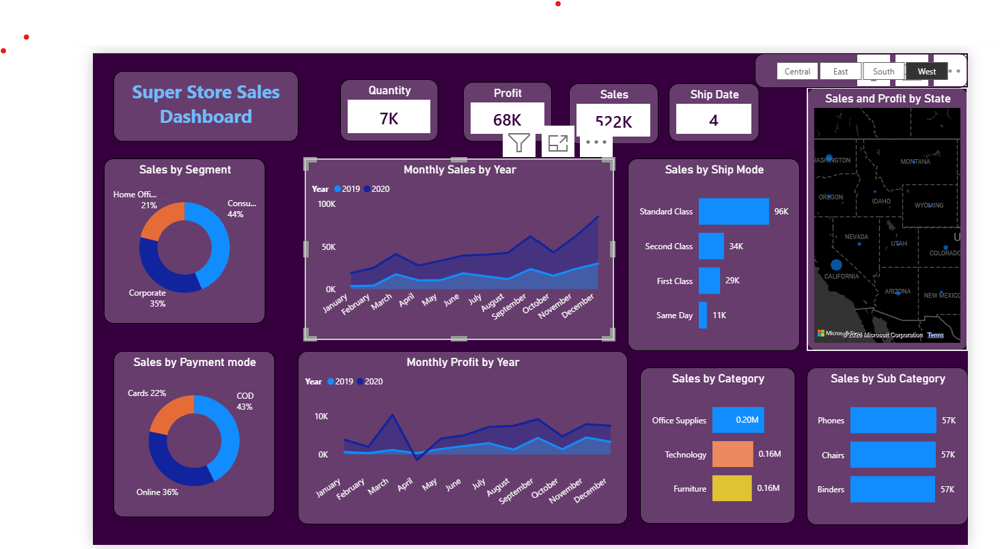

# 📊 Super Store Sales Dashboard (Power BI)

## 🚀 Project Overview
This project is an interactive **Sales Dashboard** built using Power BI to analyze and visualize sales performance of a superstore dataset.

It helps in understanding sales trends, profit distribution, and customer behavior using dynamic visuals.

---

## 🛠️ Tools & Technologies
- Power BI  
- Microsoft Excel  
- Data Visualization  
- DAX (Basic)

---

## 📊 Key Features
✔️ Sales, Profit & Quantity KPIs  
✔️ Monthly Sales & Profit Trends  
✔️ Sales by Segment, Category & Sub-Category  
✔️ Sales by Payment Mode  
✔️ Sales by State Analysis  
✔️ Sales Forecasting  

---

## 📈 Key Insights
- 📌 California generates the highest sales  
- 📌 Technology category performs the best  
- 📌 Sales increase in the last quarter of the year  
- 📌 COD is the most used payment mode  

---

## 🖼️ Dashboard Preview

### 🔹 Main Dashboard

### 🔹 Sales Forecast

---

## 📂 Project Files
- 📁 `SalesDashboard.pbix` → Power BI file  
- 🖼️ `dashboard.png` → Dashboard screenshot  
- 🖼️ `forecast.png` → Forecast screenshot  
- 📊 `dataset.xlsx` → Dataset used  

---

## 💡 Learnings
- Created interactive dashboards using Power BI  
- Improved data visualization skills  
- Learned basic DAX calculations  
- Understood business insights from raw data  

---

## 📌 Author
**Ayushi Saini**

---

